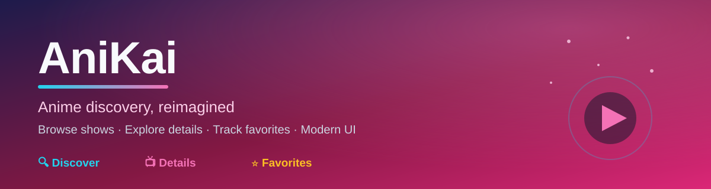
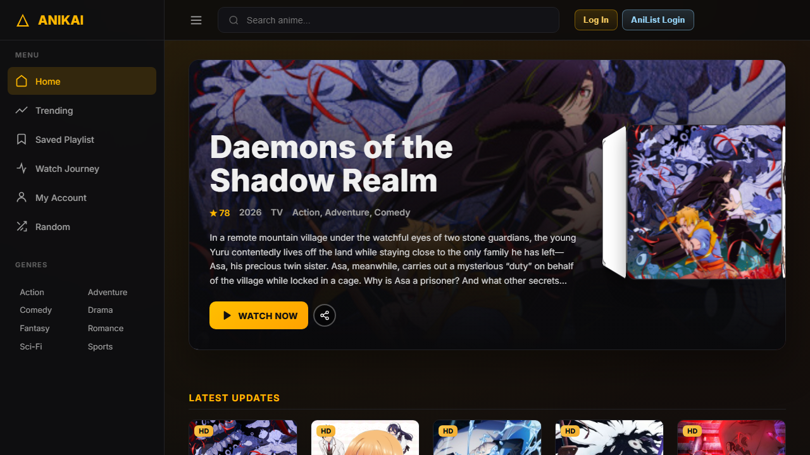

<div align="center">

<p>
  
</p>

### Anime discovery, reimagined — browse shows, explore details, and track favorites in a modern UI

**Discover. Details. Favorites. — your clean anime companion, live on the web.**

[](https://ani-kai.vercel.app)
[](https://github.com/akyourowngames/AniKai/commits/master)
[](https://github.com/akyourowngames/AniKai/stargazers)
[](#)
[](#)
[](#)

<p>
  <a href="#-live-demo">Live Demo</a> ·
  <a href="#-highlights">Highlights</a> ·
  <a href="#-tech-stack">Tech Stack</a> ·
  <a href="#-quick-start">Quick Start</a> ·
  <a href="#-support">Support</a>
</p>

</div>

---

## 🔍 Why AniKai?

> **A focused, modern anime discovery experience.** No clutter — just search, browse, dive into details, and keep a list of what you love.

AniKai is built as a clean entertainment-style web app with a sharp portfolio identity: discovery first, details second, favorites always.

**The three pillars:**

- 🔍 **Discover** — fast anime search and browsing with a focused niche for fans.
- 📺 **Details** — rich show pages with metadata, relations, and exploration.
- ⭐ **Favorites** — track the shows you care about in a personal list.

---

## 🚀 Live Demo

Try it now: **[ani-kai.vercel.app](https://ani-kai.vercel.app)**

<p align="center">
  
</p>
<p align="center"><sub>Live capture of the deployed AniKai app on Vercel.</sub></p>

---

## ⚡ Highlights

| | | |
|---|---|---|
| 🔎 **Anime discovery** | 📖 **Detail pages** | 💾 **Favorites & tracking** |
| Search and browse with a clean, fan-focused UX. | Explore shows, metadata, and related titles. | Keep a personal list of what you love. |
| 🎨 **Modern UI** | ⚡ **Vercel deployment** | 🧩 **API-driven** |
| Entertainment-style frontend built for speed. | Always-on production build, auto-deployed. | Powered by an anime data API integration. |
| 🧭 **Clear niche** | 🛠️ **Portfolio-grade** | 🚀 **Extensible** |
| Positioned for anime fans, not generic catalogs. | Great showcase of frontend + API work. | Solid base for watchlists and more. |

---

## 🧱 Tech Stack

- **Language:** TypeScript / JavaScript
- **Frontend:** React / Next.js (App Router style)
- **Hosting:** Vercel (auto-deploy from `master`)
- **Data:** Anime data/API integration

---

## 🏁 Quick Start

```bash
git clone https://github.com/akyourowngames/AniKai.git
cd AniKai
npm install
```

```bash
npm run dev
# open http://localhost:3000
```

Deploy in one click with Vercel, or import the repo and set the root as the build source.

---

## 🗺️ Roadmap

- [ ] Screenshots of search and detail pages (in progress — see above!)
- [ ] Document data source and API requirements
- [ ] Loading, empty, and error state notes
- [ ] Favorites / watchlist persistence

---

## 🤝 Contributing

Contributions, ideas, and polish suggestions are welcome. Open an issue with a clear problem statement or a focused pull request.

---

## 📈 Star History

[](https://www.star-history.com/#akyourowngames/AniKai&Date)

If AniKai is useful or just looks cool, a ⭐ helps others find it.

---

## 💬 Support

- **Bug or idea?** [Open an issue](https://github.com/akyourowngames/AniKai/issues).
- **Questions?** Reach out via the profile README.

> Built by [@akyourowngames](https://github.com/akyourowngames). If this sparked an idea, consider starring the repo. 🌸

---

## 🔗 More from the same author

- [friday](https://github.com/akyourowngames/friday) — local-first AI assistant (graph memory, semantic routing, FastAPI/Next.js).
- [A.N.K.I.T.A](https://github.com/akyourowngames/A.N.K.I.T.A) — Python personal AI assistant with voice, memory, Telegram.
- [echo89](https://github.com/akyourowngames/echo89) — local-first cinematic music player.

---

## License

See repository for license details.
